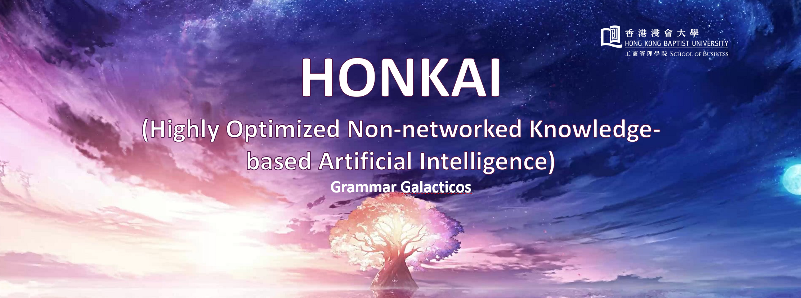
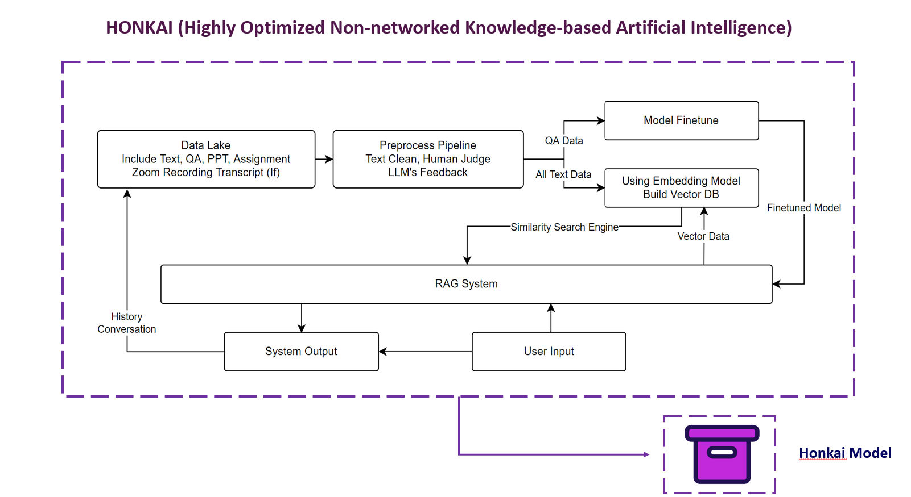

```
This project is for HKBU FIN7880 Textual Analysis in Finance and Accounting Group Grammar Galacticos
This project is written by following person:

Qingan Li 
Daniel Akplor 
Begyina Mensah
Eugene Aikins
Yasmine Ramadhani
Billy

Ranking in no particular order, all the authors contributed to this project equally.
```

# Project Describe
The primary objective of this assignment is to help with Final Examination of FIN 7870 Financial Derivatives and Risk Management.

# Project Structure


# How to use
## Pre requirement
You have to install Docker on your device. And the Docker is running. Here is the offical download link of Docker:

[Docker Install Link](https://www.docker.com/products/docker-desktop/)

## Quick Start
### 1. Select the version in Release that you want to use
After you install the Docker, go to release and found the package version that you want to use. Here is following different version of this project:
```
HONKAI Lite:
This version only provides you with only similarity search with no added LLM function.

HONKAI Pro:
This version provides the similarity search with local LLM function. The system will first find the related information  and answer you with the related information.

HONKAI Online:
This version provides the close source LLM model access ability. You can use any different close source LLM model. Compatible with OpenAI, Claude, ChatGLM, Yi... (Any platform that compatible with openai python package.)
```
| Close Source LLM Platform Link | [OpenAI](https://platform.openai.com/) | [Claude](https://console.anthropic.com/) | [ChatGLM](https://open.bigmodel.cn/) | [Yi](https://platform.lingyiwanwu.com/) | ... |
| --- | --- | --- | --- | --- | --- |
| Access Ability | No HK | Only USA | HK OK | HK OK | ... |
| Price | Most Expensive | Cheaper than OpenAI | Cheap (Lots of Free Token) | Cheap (Free Token) | ... |

### 2. Unzip
Using any zip software to unzip the file. You will get one `docker-compose.yaml` and one `resources` folder.

- If you are using `Lite` and `Online` version, there is only `vectordb` folder inside.

- If you are using `Pro` version, there are `vectordb` and `model` folders inside.

### 3. Start

After that, no matter you are using `Mac` or `Windows`. Start the `Terminal`/`CMD`. Set the path to this root folder (the one you just unzip). And enter command `docker-compose up`. 

Then after few minutes (around 2-3 for `Lite` and `Online`, if `Pro`, maybe longer), open any browser you have, and enter the `localhost`. Try to input something. (It maybe slow for the first time you input.). If there is return and no error, then means deployment is done. Congradulation.

### 4. Clean Up
If you don't want use this any more, there is a easy way to uninstall.
- Uninstall the Docker
- Delete the files
- Done

## Bring with your own data (Experiment)
For any version, we provide a API link for you to create your own database. You can insert your own dataset inside. Here is the details:
- Endpoint: `/create_point_with_payload`
- Accept Json formate: 
```json
{
    "chapter": <This field is for chapter number, if you don't have, make this empty with "">,
    "title": <This field is for chapter title, if you don't have, make this empty with "">,
    "problem": <This field is for question ID, if you don't have, make this empty with "">,
    "question": <This field is for questions>,
    "answer": <This field is for answer>,
    "messages": <You can input any text you want, this field will become the vector and use for similarity search. e.g. You can equal this part as 'answer' or 'question' or 'answer + question'>
}
```
- You can use post method to post your data to this Endpoint. It will return you with "Success". Which means your data is successfully input.

## Using another LLM model (Experiment)
Note: This action may need some basic knowledge of using Docker.

For `Pro` user, you can change the LLM model according to your device performance.

The LLM is support by container "Ollama". In order to change your model, you need do following step:
- Go to the Docker Desktop
- Click `"Ollama"` container.
- Go to exec tag
- Enter `ollama list` to check all downloaded model, or using `ollama ps` to check the model currently run.
- Go to ollama library to looking for available model. [Ollama Library](https://ollama.com/library)
- Found the model that you want to use, and then remember the name, and go back to docker exec, enter `ollama run <you model name>:<tag>`. And wait for download finish.
- After download finish, you can use the model.
- Meanwhile, you need to change the model name in source code. And rebuild the docker. 

Note: We are still working on how to find a easy way for you to change the model. If you have any idea, welcome to push an issues or pull requests.

